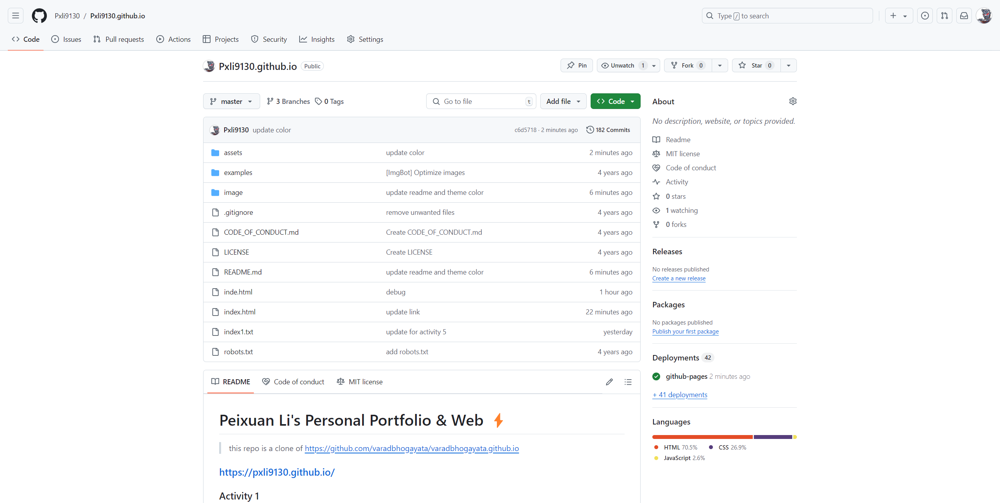
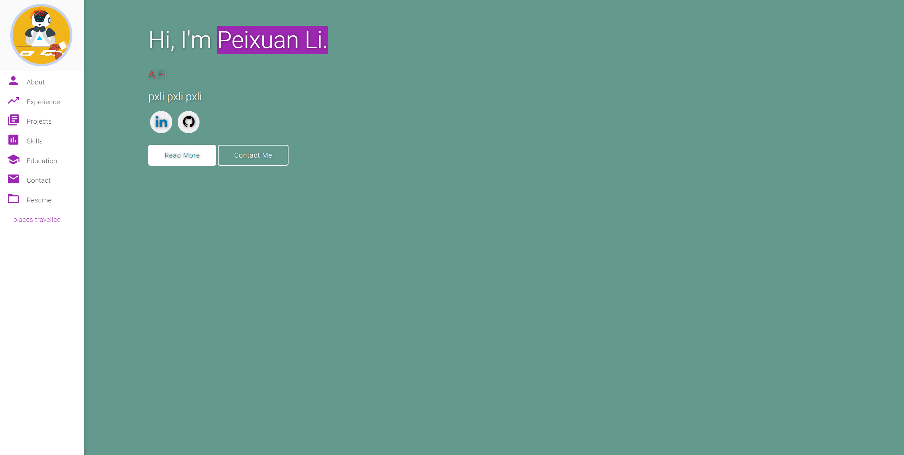
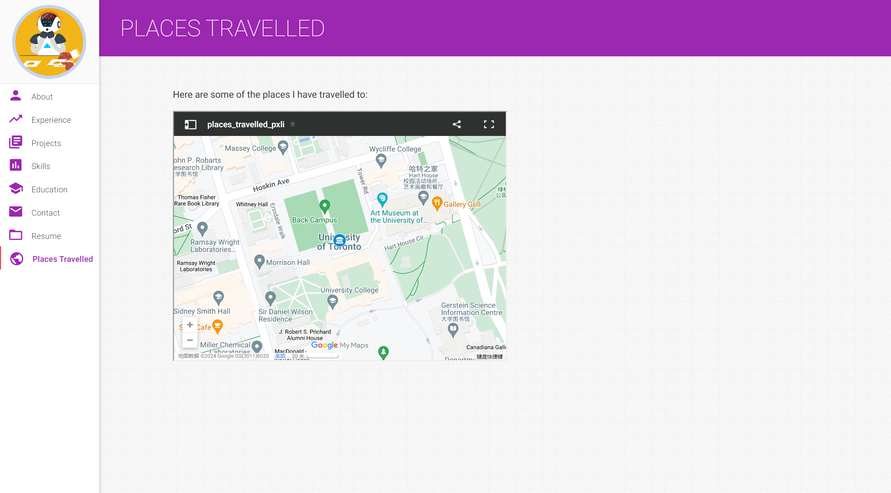
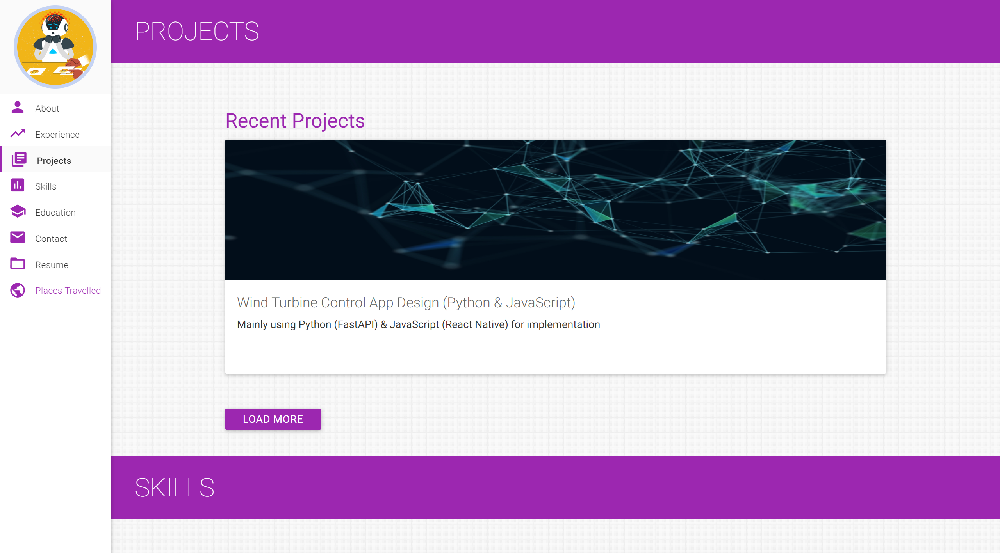
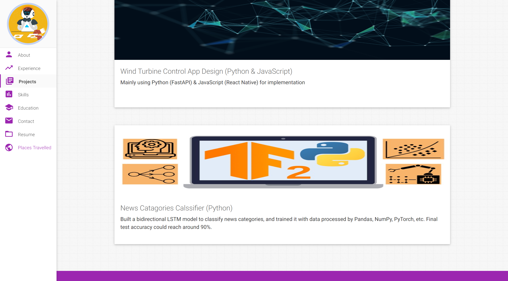

# Peixuan Li's Personal Portfolio & Web ⚡️

> this repo is a clone of https://github.com/varadbhogayata/varadbhogayata.github.io

### https://pxli9130.github.io/

### Activity 1

 
  <kbd>
    
  </kbd>

### Activity 2

 
  <kbd>
    
  </kbd>

 
  <kbd>
    
  </kbd>

### Activity 3

 
  <kbd>
    
  </kbd>

 
  <kbd>
    
  </kbd>

### Activity 4

 
  <kbd>
    
  </kbd>

 
  <kbd>
    
  </kbd>

### Activity 5

 
  <kbd>
    
  </kbd>

 
  <kbd>
    
  </kbd>

 
  <kbd>
    
  </kbd>

